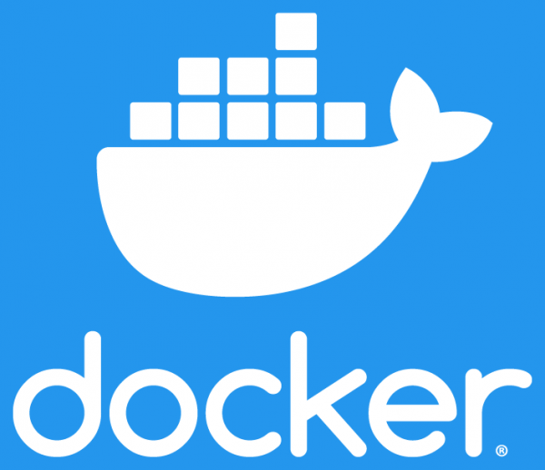
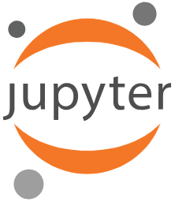
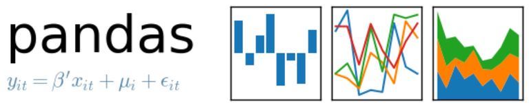

<h1 align="center">🤠 G'Day! I'm Anton</h1>
<div  align="center">
  <p>I'm a software engineer, based in Melbourne, Australia. </p>
  <p>
    I switched into tech after more than a decade in Civil Engineering and Project Management consulting - I rediscovered my passion and living the dream now, building digital products and hoping to make the world a better place. 🧀
  </p>
  <p>I am focused on FinTech back-end, CyberSecurity and Machine Learning. I do enjoy very very much what I do</p>
</div>

<div align="center">

  [](https://www.linkedin.com/in/panteleev/)
  
  
 ###  My www portal :tada: 
  [https://friendlyantz.me/](https://friendlyantz.me/)

</div>
<br>

### How I'd define myself...literally

```ruby
class Anton
  def initialize
    @name = 'Anton Panteleev'
    @dob = "1987-04-01T04:15:00"
    @work = 'FinTech Software Engineer'
    @education = [ 'Auckland University of Technology',
                   'Moscow State University of Civil Engineering',
                   'Le Wagon' ]
    @hobbies = [  'Kitesurfing', 
                  'Camping',
                  'Motorcycling',
                  'Longboarding' ]
  end

  def current_location
    'Melbourne, Australia'
  end

  def previous_locations
    [ 'Brisbane, Australia',
      'Auckland, New Zealand',
      'Moscow, Russia' ]
  end
end
```
 
<br>

### Some of the technologies that I use are:
<p float="left">
  
  
  
  
  
  
  
  
 </p>

### I'm currently working on learning the following:
<p float="left">
 
 
</p>


<br>

### What I sometimes play with
<p>
  <!--  -->
  
  
  <!--  -->
  <!--  -->
</p>

<br>

### My Hackathons
<table>
  <tr>
    <td></td>
    <td><a href="https://devpost.com/software/swif-shop-with-friends">SQUAREUP Hackathon: SWiF - Shop With Friends</a></td>
  </tr>
</table>

<br>

### Books I read / recommend

- 'Working with Legacy Code by Michael Feathers ', 
- '99 Bottles of OOP by Sandi Metz', 
- 'Object Oriented Design Principles by Sandi Metz',
- ['Ruby Under a Microscope'](https://github.com/friendlyantz/ruby_under_microscope)


```python
def python_books(x):
    'Automate the Boring Stuff with Python'
```
<br>

### Quick stats about me
| Github Stats | Top Languages |
| --- | --- |
|  |  |


 [](https://github.com/friendlyantz?tab=repositories) [](https://github.com/friendlyantz?tab=stars)
