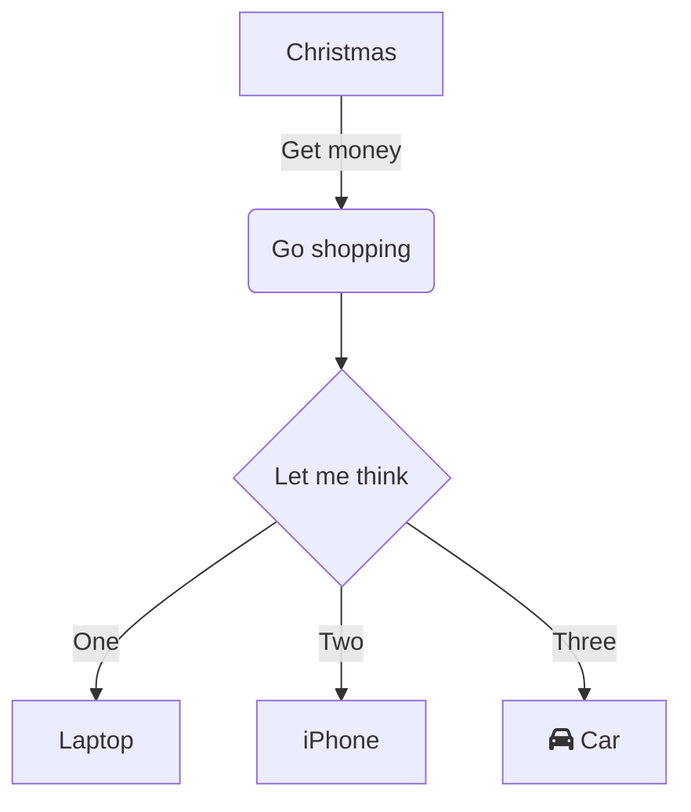

# iTerm

| key                 | cmd                                   |
| ------------------- | ------------------------------------- |
| CTRL + u / y        | clear line / undo clear               |
| CMD + SHIFT + H     | list of copy-pastes                   |
| CMD + D             | new tab in pane                       |
| CMD + ENTER         | full screen switch                    |
| CMD + OPT + Arrows  | navigate between split panes(CMD + D) |
| CTRL + CMD + Arrows | resize pane                           |
| CMD + Shift + .     | edit command                          |

# Obsidian

{{title}}

sfjsdfjk


| keys                 | command               |
| -------------------- | --------------------- |
| cmd + enter, cmd + L | checkbox              |
| cmd + k              | hprlink               |
| cmd + e              | preview               |
| cmd + click_preview  | see diff with preview |
| cmd + P              | cmd pallete           |
| cmd + opt + click    | multiple cursors      |


---

## resize
[[unix |alias for unix without space after \|]]

---

## query
	use 
	```query
	#hash-taged-search
	```

```query
#recipes 
```

---

## resize img

![[avatar.jpg|50x50]]

---

## diagrams

https://mermaid.live/



---

## links 

[[obsidian#^e67fce]] - \^ -> to block \[\[\^*start typing first words of the block*]]

[[AP_IT#GENERAIL]] - \# for heading

lalalal_block ^e67fce

---

## footnotes [^1] 

	[^1]: ref details||


---

# VScode

## built in terminal

| New Column       |                  |
| ---------------- | ---------------- |
| CMD + \	NEW | pane terminals (side by side)
| CMD + Shift + \ |	side panel to delddete terminal
| CTRL + SHIFT + \` | new terminal window| 
| CMD + OPT + arrow	| navigate between panes
| CTRL + D	| Kill terminal

---

# MacOS

## mac_os settings via term
[https://github.com/mathiasbynens/dotfiles/blob/master/.macos](https://github.com/mathiasbynens/dotfiles/blob/master/.macos)

## Text

1) OPT + SHIFT + -	Writes "—"

## UI

- CTRL + arrows	Navigatebetween workspaces 
- Preview full screen CMD option Y
- CMD O open default app
- Better zip app- preview archive content
- Drag app/folder in toolbar - hold CMD
- Copying File Paths from the Mac Finder
	While in the right-click menu, hold down the OPTION key to reveal the “Copy (item name) as Pathname” option,
 - TAB SWITCH L/R - SHIFT CMD ]
- Shift + CMD + ?: access menu bar
- ⌘ + G select next find (add shift for prev)
- Command+Control+Q --> **LOCK SCREEN**

### FINDER

- Shift+CMD+. 	 show hidden
- Frequent folders shift+cmd+A/O/D/i/R(airdrop)
- Preview tab 	shift CMD P
- Resize panes equally(finder) - hold OPT
		- Boolean logic search in files: hold options, click + to add AND/OR


